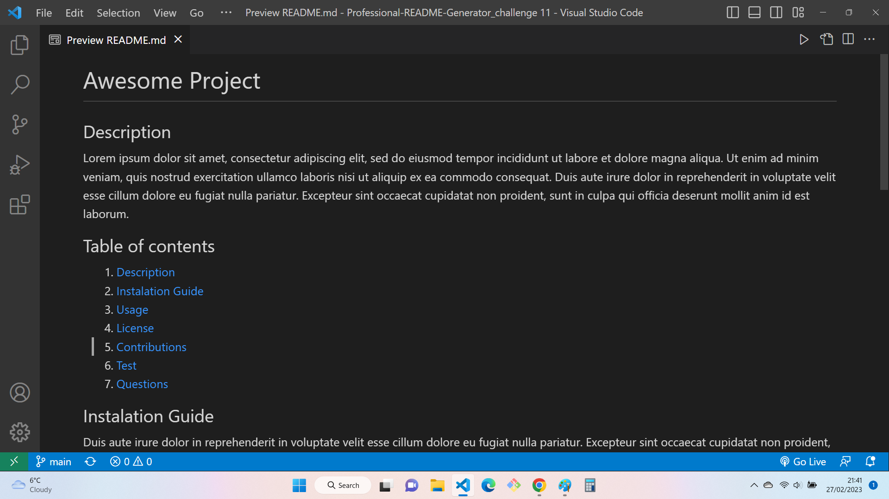

# Module 11 Professional-README-Generator
## Description

Command-line application that dynamically generates a professional README.md file from a user's input using the Inquirer package. Review the Good README Guide as a reminder of everything that a high-quality, professional README should contain.

## User Story

As a developer, I want a README generator so that I can quickly create a professional README for a new project.

## Installation
GitHub repository: https://github.com/Chaxiraxad/Professional-README-Generator.git

## Deployment
 Project url: https://chaxiraxad.github.io/Professional-README-Generator/

(ScreenShot) 

## Usage
N/A

## Credits
N/A

## License
Please refer to the LICENSE in the repository.

## Features
N/A

## Tests
N/A

## Resources
N/A